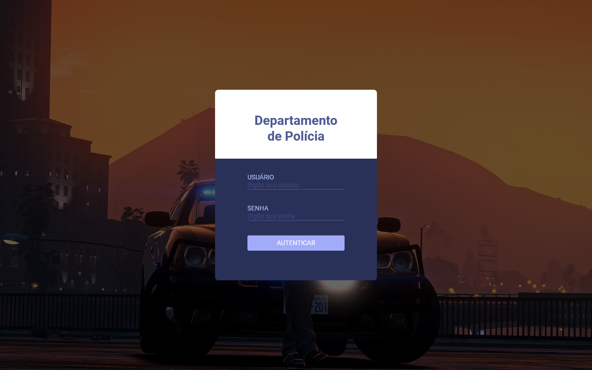

# Departamento de Polícia

O departamento de polícia da cidade local não conseguia administrar e registrar de forma rápida e simples as ocorrências que aconteciam na cidade. Vendo este problema, o delegado pediu para que um programador desenvolve-se um sistema, onde deverá conter o registro dos agravantes, podendo criar novas ocorrências, editar, visualizar e exclui-las dentre outras funcionalidades. Sendo assim foi criado um dashboard para administrar as informações.


## Requisitos 📃

- [✔] Tela de autenticação com os campos de usuário e senha;
- [✔] Tela de listagem dos Códigos Penais com os campos Nome, Data, Multa e Status.
  - [❌] Ordenação
  - [❌] Filtro
  - [✔] Paginação
  - [✔] Botão para inclusão de um novo registro.
  - [✔] Permitir editar, visualizar e excluir (com confirmação) o registro.
- [✔] Tela de Visualização com todas as informações do código penal.
- [✔] Tela de Edição.
- [✔] Tela de Inclusão.

## Tecnologias Usadas 📝
- [React](https://pt-br.reactjs.org/)
- [Styled Components](https://styled-components.com/)
- [Axios](https://axios-http.com/docs/intro)
- [React Icons](https://react-icons.github.io/react-icons/)
- [React Spinners](https://www.davidhu.io/react-spinners/)
- [ESlint](https://eslint.org/)
- [Json Server](https://www.npmjs.com/package/json-server)


## Como executar o projeto 💻
### Clonando repositório
```
$ git clone https://github.com/PequenoJoohn/departamento-policial
$ cd departamento-policial
$ yarn // Use npm install se estiver usando npm
```
### Rodando projeto
```
$ yarn start // Use npm run start se estiver usando npm

Execute também o json-server
$ cd db
$ yarn server // Use npm run server se estiver usando npm
```

## Divirta-se !!! 🍻

<div style="text-align:center">
  <h2>Faça parte da minha comunidade de programadores⤵️</h2>
  <a target="_blank" href="https://www.labzone.com.br">
    
  </a>
</p>
